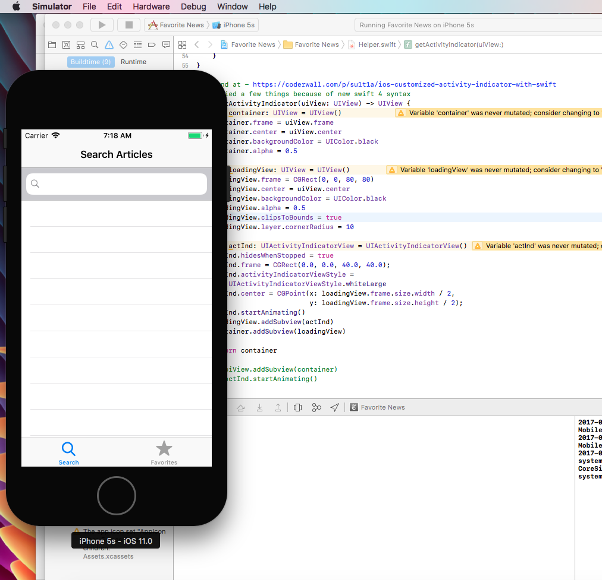
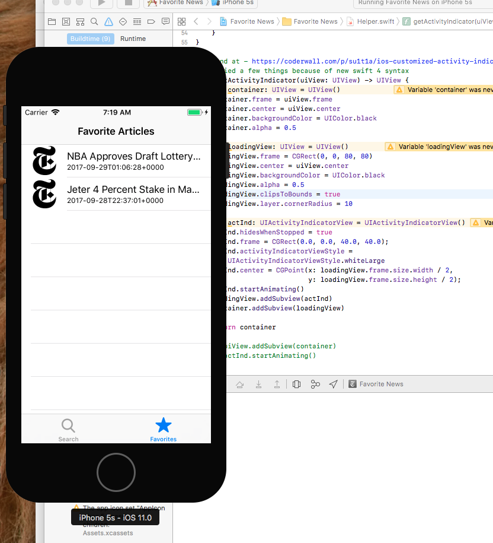
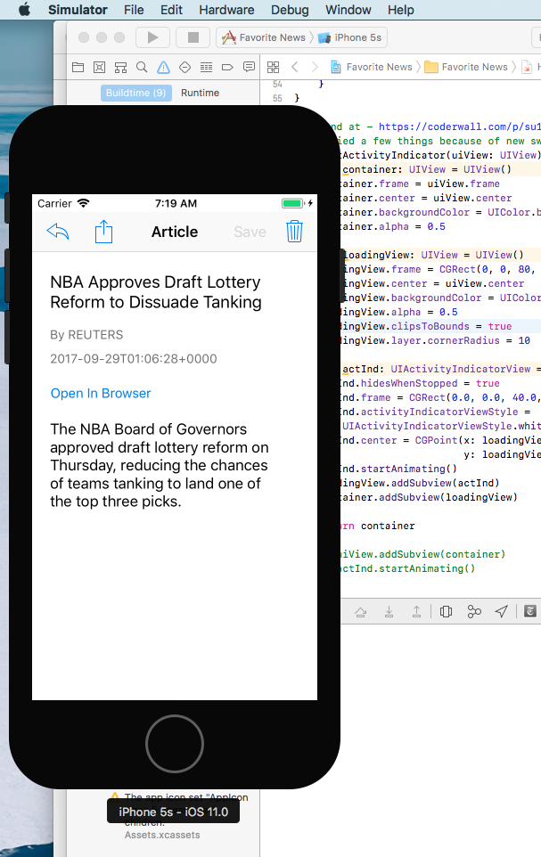

# UDACITY
### iOS Developer Nanodegree
##### P5: Capstone - Build Your Own App!

_______
> This Project Allows The Student To Be Creative And Build Their Own App, While Demonstrating All Of The Core Concepts From The Previous Lessons(UIKit, Swift, Networking Requests, Data Persistence And More).

This project is called <strong>"Favorite News"</strong>. With this app, you can save your favorite news articles that you searched from <strong>New York Times API</strong> using iOS <strong>Core Data Stack</strong> and share articles with your friends/family to keep them up-to date with current events!

To run this app on your machine(Mac OSX only), follow the steps:

* Install Xcode if you have not done so already
* Download/Clone this project
* Open the downloaded folder and double click the Xcode project file. This will launch a new window of Xcode.
* At the top, choose your simulator device.
* Press the play button to start the app, and be amazed!
* Enjoy!

_____
## Preview

