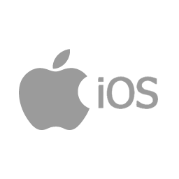

# UDACITY
### iOS Developer Nanodegree Program
##### Project 1 - Pitch Perfect!

This is the first project for UDACITY iOS Developer Nanodegree program.
The course materials for this project introduces the swift programming language and Xcode,
Apple's IDE for creating apps on many of their platforms.

To run this app on your local machine(Mac OS X only), follow these steps:

* If you have not already done so, go to Apple Store and install Xcode.
* Download this repository to your local machine. You can use git clone or download as zip. If you download as zip, you will have to extract the folders/files.
* Start Xcode
* Choose the option to open an existing project
* Select the project that you downloaded/cloned
* Once everything is loaded, press the start button at the top towards the left to run the app on the iOS simulator
* Enjoy!
