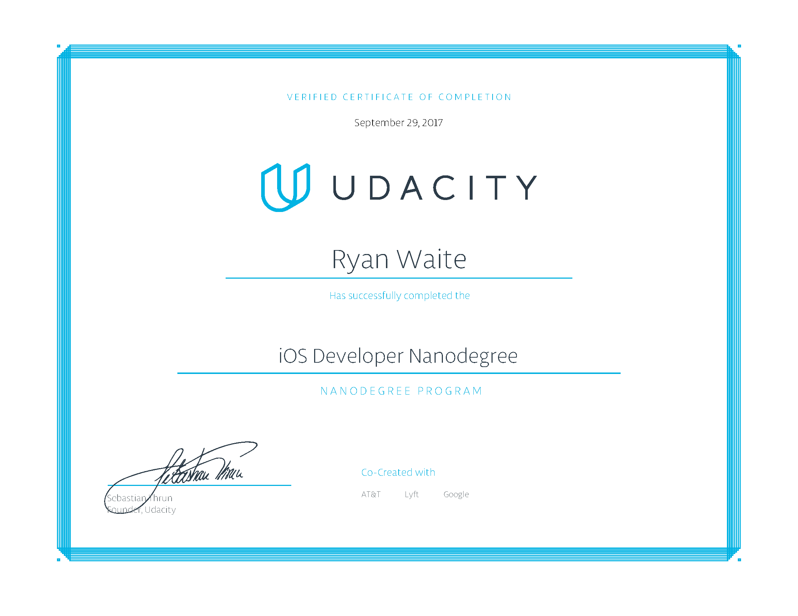

# UDACITY
### iOS Developer Nanodegree
##### ALUMNI
https://www.udacity.com/course/ios-developer-nanodegree--nd003

_______
> The journey to becoming an iOS developer begins in your imagination—that moment when you first dream up a great idea for an app. From there, you learn to program, create you first apps, and ultimately land a job as an app developer. This journey has multiple points-of-entry, depending on your skill level, and this Nanodegree program will get you to your next level whether you’re already programming, or just beginning.  
As you master the Swift programming language and create a portfolio of apps to showcase your skills, you’ll benefit from detailed code reviews, receive valuable career advice, and enjoy preferential access to new job opportunities. Enroll today, and start building your future in iOS development.

-
> Graduated In 1 Month, Thanks To Prior Knowledge! Thanks UDACITY!!! #Web #Mobile #Programmer #Developer 

Projects
* Pitch Perfect
* MemeMe
* On The Map
* Virtual Tourist
* Favorite News
